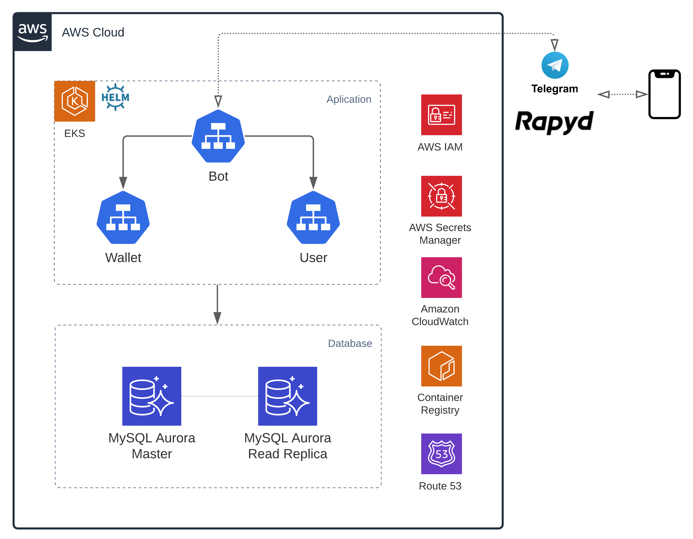

# AWS CDK project for Rapydbot!

## Prerequisites

You must need to install the following binaries before to deploy:

- [AWS CLI v2.2.14+](https://docs.aws.amazon.com/cli/latest/userguide/install-cliv2.html)
    - Configure a profile with sufficient permissions to deploy IAM, EC2, EKS, RDS, Lambda, S3, Cloudformation, Route53 and Secrets Manager.
- [AWS CDK v1.110+](https://docs.aws.amazon.com/cdk/latest/guide/getting_started.html#getting_started_install)
- [Python v3.6+](https://www.python.org/downloads/)
- [Pip](https://pip.pypa.io/en/stable/installing/)

### Create Secret

Create a Secret using AWS Secrets Manager with the following values. **Please substitute the values with your information**.

```json
{
  "rapyd_access_key": "<your-rapyd-access-key>",
  "rapyd_secret_key": "<your-rapyd-secret-key>",
  "bot_token": "<your-telegram-bot-token>",
  "db_host": "db.rapydbot.local",
  "username": "admin",
  "password": "<your-password>",
  "db_wallet": "WALLET",
  "db_user": "USER"
}
```

You can use this command to create your secret using AWS CLI. 

```shell
aws --region <your-region> secretsmanager create-secret --name <your-secretname> --secret-string file://yourCreds.json
```

### Create ACM Public Certificate (optional)

It is recommended to publish the Bot Service in https so it is necessary to [request a certificate in ACM](https://docs.aws.amazon.com/acm/latest/userguide/gs-acm-request-public.html).

### Create Parameter File

It's required use a yaml file name `values.yaml`. In this file we are going to write all the parameters to configure our application. You can use the file `values_example.yaml` as example.

The following table lists the configurable parameters of the rapydbot CDK template.

| Parameter              | Description                                                                                                       | Required     | Default      |
| ---------------------- | ----------------------------------------------------------------------------------------------------------------- | ------------ | ------------ |
| `secretsManager.arn`   | Secret ARN that you created previously                                                                            | **Required** |              |
| `chartVersion`         | [Helm Chart Version](https://github.com/aufacicenta/rapydbot-chart). If not specified, the latest version is used | Optional     |              |
| `namespace`            | K8s namaspace used to deploy the application                                                                      | Optional     |              |
| `workers.instanceType` | EKS workers node instance type                                                                                    | Optional     | `t3a.medium` |
| `workers.number`       | EKS Number of Workers                                                                                             | Optional     | `2`          |
| `bot.certArn`          | AWS ACM Certificate. Required if you want to use https for the bot service                                        | Optional     |              |
| `env`                  | Variable to tag resources                                                                                         | Optional     | `test`       |

*Note: The only parameter requierd is `secretsManager.arn`.*

## Installation

Create a virtualenv:

```shell
$ python3 -m venv .venv
```

After the init process completes and the virtualenv is created, you can use the following
step to activate your virtualenv.

```shell
$ source .venv/bin/activate
```

Once the virtualenv is activated, you can install the required dependencies.

```shell
$ pip install -r requirements.txt
```

At this point you can deploy the application :)

```shell
$ cdk deploy
```

The whole process takes about 30 minutes, be patient.

## Useful commands

 * `cdk ls`          list all stacks in the app
 * `cdk synth`       emits the synthesized CloudFormation template
 * `cdk deploy`      deploy this stack to your default AWS account/region
 * `cdk diff`        compare deployed stack with current state
 * `cdk docs`        open CDK documentation

Enjoy!

## Infrastructure Details

The infrastructure was implemented on a cloud-native architecture on AWS using Kubernetes to enable simplified and quick administration, monitoring, automation, and scalability. The best practices and recommendations of the Well Architected Framework are followed to build a secure and efficient for the cloud.

### Architecture Diagram



### Automated deployment
The  infrastructure is code. The whole deployment of Rapidbot was automated with AWS CDK, which enables the creation of resources on AWS using python. The source code is available at: https://github.com/aufacicenta/rapydbot-infra 

### Application layer

Kubernetes (EKS) with a Helm chart is used for the application layer. This allows flexibility and the ability to deploy the application to any Kubernetes cluster, which is why Rapydbot is cloud agnostic. It should be noted that this is automatically deployed by the CDK template. The source code is available at: https://github.com/aufacicenta/rapydbot-chart 

### Database layer

Amazon Aurora for MySQL is used for the database tier. This helps us delegate some administrative tasks (Backups, Replicas, etc.) to AWS. In the same way, it is possible to use any version of MySQL.
Networking

The solution is deployed in multiple Availability Zones (AZs) in the selected AWS Region. The resources are created inside a VPC, which uses public, private subnets and NAT Gateway enables resources in the private subnets to exit to the internet in a secure manner.

### Security
All sensitive data (api keys, passwords, tokens) are stored in AWS Secrets Manager, allowing the containers to access them safely. Additionally, the principle of least privilege is used, whereby all resources have only the necessary permissions. Also IAM, Security Groups and Service Accounts protect the access to the resources

### High Availability and Scalability

High availability is contemplated by design using at least two Availability Zones, two Kubernetes worker nodes, and two DB instances (one primary and one replica). Autoscaling is used to scale when demand requires it and is managed by Kubernetes.

### Monitoring

The logs and metrics of the application (CPU, RAM, Disk) are sent to CloudWatch, which allows real-time monitoring of the status of the services and to create alarms based on them.

### Costs

The costs depend on the amount, the size of the resources that are used and even reserve them, but assuming a small scenario in multiAZ they are approximately 280 dollars per month. Please note that this is an estimate only for production environments, other variables must be taken into consideration. The cost estimate is available at: https://calculator.aws/#/estimate?id=fb223b000de6563c5556b8915bb0fe351eebd796 